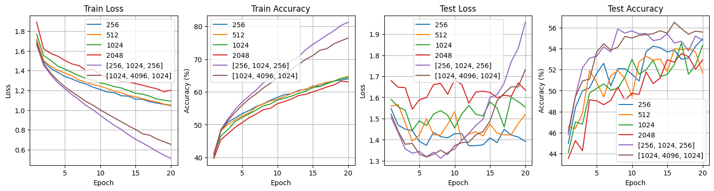
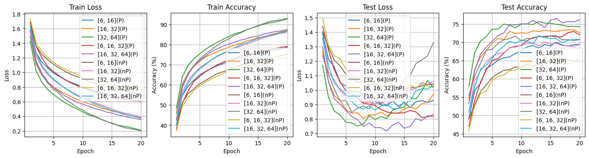
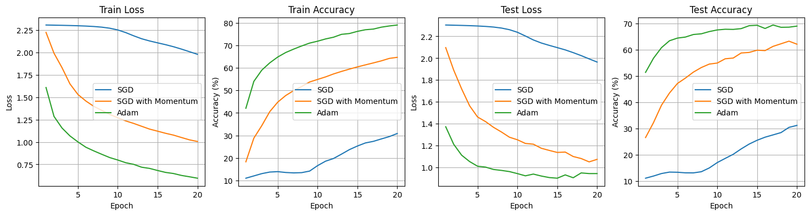
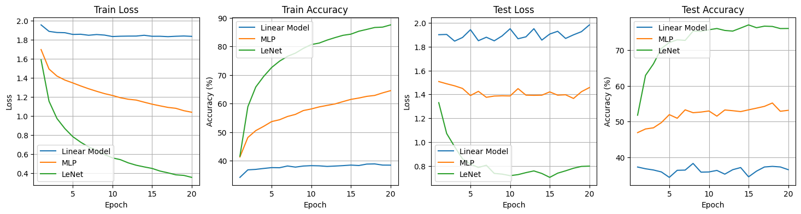

# 《2025 Fall 机器学习与数据挖掘》 作业 2

## 实验内容
探索神经⽹络在图像分类任务上的应⽤。在给定数据集 CIFAR-10 的训练集上训练模型，并在测试集上验证其性能。
要求：
1) 在给定的训练数据集上，分别训练一个线性分类器（Softmax 分类器），多层感知机（MLP）和卷积神经网络（CNN）
2)  在 MLP 实验中，研究使用不同网络层数和不同神经元数量对模型性能的影响
3)  在 CNN 实验中，以 LeNet 模型为基础，探索不同模型结构因素（如：卷积层数、滤波器数量、Pooling 的使用等）对模型性能的影响
4)  分别使用 SGD 算法、SGD Momentum 算法和 Adam 算法训练模型，观察并讨论他们对模型训练速度和性能的影响
5)  比较并讨论线性分类器、MLP 和 CNN 模型在 CIFAR-10 图像分类任务上的性能区别
6)  学习一种主流的深度学习框架（如：Tensorfolw，PyTorch，MindSpore），并用其中一种框架完成上述神经网络模型的实验
## 实验环境
- 操作系统：Windows 11
- Python 版本：3.13.3
- pytorch 版本：2.8.0+cu128
## 实验过程
### 模型结构
线性模型的结构如下：
```python
class LinearModel(torch.nn.Module):
  def __init__(self, input_size: int, num_classes: int):
    super().__init__()
    self.linear = torch.nn.Linear(input_size, num_classes)

  def forward(self, x: torch.Tensor) -> torch.Tensor:
    x = x.view(x.size(0), -1)
    return self.linear(x)
```

MLP 的模型结构如下：
```python
class MLP(torch.nn.Module):
  def __init__(self, input_size: int, hidden_size: list[int] | int, num_classes: int):
    super().__init__()
    if isinstance(hidden_size, int):
      hidden_size = [hidden_size]
    self.layers = torch.nn.ModuleList()
    in_features = input_size
    for hidden in hidden_size:
      self.layers.append(torch.nn.Linear(in_features, hidden))
      self.layers.append(torch.nn.ReLU())
      in_features = hidden
    self.layers.append(torch.nn.Linear(in_features, num_classes))

  def forward(self, x: torch.Tensor) -> torch.Tensor:
    x = x.view(x.size(0), -1)
    for layer in self.layers:
      x = layer(x)
    return x
```

为了灵活修改不同的层数，`hidden_size`支持传入一个列表。

CNN 的结构如下：
```python
class LeNet(torch.nn.Module):
  def __init__(
    self,
    num_classes: int,
    conv_channels: list[int] = [6, 16],
    pooling: bool = True,
  ):
    super().__init__()
    conv = []
    in_channels = 3
    stride = 1 if pooling else 2
    for out_channels in conv_channels:
      conv.append(torch.nn.Conv2d(in_channels, out_channels, kernel_size=5, stride=stride, padding=2))
      conv.append(torch.nn.ReLU())
      if pooling:
        conv.append(torch.nn.MaxPool2d(kernel_size=2, stride=2))
      in_channels = out_channels
    self.conv = torch.nn.Sequential(*conv)
    sz = 32 // (2 ** len(conv_channels))
    self.fc1 = torch.nn.Linear(in_channels * sz * sz, 120)
    self.fc2 = torch.nn.Linear(120, 84)
    self.fc3 = torch.nn.Linear(84, num_classes)
    self.relu = torch.nn.ReLU()

  def forward(self, x: torch.Tensor) -> torch.Tensor:
    x = self.conv(x)
    x = x.view(x.size(0), -1)
    x = self.relu(self.fc1(x))
    x = self.relu(self.fc2(x))
    x = self.fc3(x)
    return x

```

这是经典的 LeNet 网络，并将其中卷积层的参数暴露出去便于灵活修改。最后的 MLP 层不作修改。

### 数据准备
读取数据的过程：
```python
def load_data(dir):
  import pickle
  import numpy as np

  X_train = []
  Y_train = []
  for i in range(1, 6):
    with open(dir + r'/data_batch_' + str(i), 'rb') as fo:
      dict = pickle.load(fo, encoding='bytes')
    X_train.append(dict[b'data'])
    Y_train += dict[b'labels']
  X_train = np.concatenate(X_train, axis=0)
  with open(dir + r'/test_batch', 'rb') as fo:
    dict = pickle.load(fo, encoding='bytes')
  X_test = dict[b'data']
  Y_test = dict[b'labels']

  X_train = X_train.reshape(-1, 3, 32, 32)
  X_test = X_test.reshape(-1, 3, 32, 32)

  return X_train, Y_train, X_test, Y_test
```

数据从本地文件中取出，并将`X_train`和`X_test`重新映射成`(N, 3, 32, 32)`的图片 batch 形式。

之后，将其转成 tensor 并交给 Dataset 管理，最后转交给 DataLoader：
```python
X_train = torch.tensor(X_train).float().to(device)
X_test = torch.tensor(X_test).float().to(device)
Y_train = torch.tensor(Y_train).long().to(device)
Y_test = torch.tensor(Y_test).long().to(device)
dataset_train = Dataset(X_train, Y_train, transform=transform_train)
dataset_test = Dataset(X_test, Y_test, transform=transform_test)
train_loader = DataLoader(dataset_train, batch_size=batch_size, shuffle=True)
test_loader = DataLoader(dataset_test, batch_size=batch_size, shuffle=False)
```

两个 transform 的实现分别为：
```python
class ZeroOneNormalize:
  def __call__(self, tensor: torch.Tensor):
    return tensor.float().div(255)
    
transform_train = transforms.Compose(
  [
    transforms.RandomHorizontalFlip(),
    ZeroOneNormalize(),
    transforms.Normalize((0.4914, 0.4822, 0.4465), (0.2023, 0.1994, 0.2010)),
  ]
)

transform_test = transforms.Compose(
  [
    ZeroOneNormalize(),
    transforms.Normalize((0.4914, 0.4822, 0.4465), (0.2023, 0.1994, 0.2010)),
  ]
)
```

transforms 直接对 Tensor 操作，省去了 ToTensor 的步骤，具有更高的性能。
### 训练过程
整个训练的代码：
```python
def train(
  device: torch.device,
  model: Any,
  epochs: int,
  batch_size: int,
  lr: float,
  criterion: torch.nn.Module,
  optimizer: Literal['sgd', 'sgd_momentum', 'adam'],
  transform_train: transforms.Compose | None,
  transform_test: transforms.Compose | None,
):
  X_train, Y_train, X_test, Y_test = load_data(r'C:\Temp\material2-CIFAR10\data')

  X_train = torch.tensor(X_train).float().to(device)
  X_test = torch.tensor(X_test).float().to(device)
  Y_train = torch.tensor(Y_train).long().to(device)
  Y_test = torch.tensor(Y_test).long().to(device)
  dataset_train = Dataset(X_train, Y_train, transform=transform_train)
  dataset_test = Dataset(X_test, Y_test, transform=transform_test)
  train_loader = DataLoader(dataset_train, batch_size=batch_size, shuffle=True)
  test_loader = DataLoader(dataset_test, batch_size=batch_size, shuffle=False)

  match optimizer:
    case 'sgd':
      optim = torch.optim.SGD(model.parameters(), lr=lr)
    case 'sgd_momentum':
      optim = torch.optim.SGD(model.parameters(), lr=lr, momentum=0.9)
    case 'adam':
      optim = torch.optim.Adam(model.parameters(), lr=lr)
    case _:
      raise ValueError(f'Unknown optimizer: {optimizer}')

  model.to(device)
  
  test_acc = 0.0

  for epoch in range(epochs):
    model.train()
    train_loss = 0.0
    train_correct = 0
    train_total = 0

    for images, y_true in train_loader:
      optim.zero_grad()
      with torch.autocast('cuda'):
        outputs = model(images)
        loss = criterion(outputs, y_true)
      loss.backward()
      optim.step()

      train_loss += loss.item()
      y_pred = torch.argmax(outputs.data, 1)
      train_total += y_true.size(0)
      train_correct += (y_pred == y_true).sum().item()

    train_acc = 100 * train_correct / train_total
    train_loss = train_loss / len(train_loader)

    model.eval()
    test_correct = 0
    test_total = 0
    test_loss = 0.0

    with torch.no_grad():
      for images, y_true in test_loader:
        with torch.autocast('cuda'):
          outputs = model(images)
          loss = criterion(outputs, y_true)
        test_loss += loss.item()
        y_pred = torch.argmax(outputs.data, 1)
        test_total += y_true.size(0)
        test_correct += (y_pred == y_true).sum().item()

    test_acc = 100 * test_correct / test_total
    test_loss = test_loss / len(test_loader)

    print(
      f'Epoch [{epoch + 1:>2}/{epochs}], Train Loss: {train_loss:.4f}, Train Acc: {train_acc:.2f}%, Test Loss: {test_loss:.4f}, Test Acc: {test_acc:.2f}%'
    )
```

训练过程对三种模型而言是相同的，但在超参数或者损失/优化函数部分保留调整空间。

因为本实验的 CNN 使用的是 LeNet 这样的初期 CNN 模型，训练过程中除了使用 amp 加快训练速度外没有进行其他过于精细化的调度（如 lr_scheduler，clip_grad 等操作），这在上学期的人工智能课已经做过足够的尝试，本实验主要目标还是为了凸显三类模型的性能差异，而不是榨干模型的性能。

### 模型测试
先进行 MLP 不同隐藏层参数的实验，配置了 6 组参数：
1. 256
2. 512
3. 1024
4. 2048
5. （256, 1024, 256）
6. （4096, 8192, 4096）

其他训练参数统一为：
- epochs：20
- 损失函数：CrossEntropyLoss，即经过 softmax 后取 log 计算交叉熵
- 优化器：Adam
- batchsize：128
- learning rate：0.001

训练结果如下：

使用深层网络的两组在训练速度上有明显优势，但训练后期有点过拟合，不是很想调参。

然后进行 CNN 的不同参数的测试，直接放测试结果：

其中方括号内的内容是每层卷积核的数量，P/nP 表示是否使用了 pooling 层。如果不使用，则设置卷积层的 stride=2 以保持最后的 fc 层具有相同的参数，其余参数与 MLP 实验保持一致。

从结果可知 pooling 层对过拟合的抑制具有较为明显的效果，对卷积层的规模进行一定程度的 scaling 可以提升模型性能。

最后进行不同优化器（SGD， SGD with Momentum，Adam）的测试，模型采用默认参数的 LeNet：

lr=0.001 对 SGD 而言确实太慢，20 个 epoch 过去还远远没有收敛的迹象；加入 Momentum 后收敛速度大幅改善，而 Adam 更是大大加快了速度与准确率。

使用三个优化器进行训练，所用时间没有明显差异。

最后，将三类模型进行对比，模型参数为：
- 线性模型：没有可调整的参数
- MLP：隐藏层维度使用 256
- LeNet：卷积层核数为（16, 32, 64)，使用 pooling
- 优化器：使用 Adam

对比结果：

### 实验总结
本次实验围绕 CIFAR-10 图像分类任务，构建、训练并评估了三种不同复杂度的模型：线性模型、MLP 和 CNN，通过一系列对比实验，研究和验证了一部分超参数对模型性能的影响，主要结论有：
1. 模型结构与性能的关系：线性模型作为最简单的 baseline，其性能最差，最终测试准确率不到 40%，本质原因是简单的线性模型无法学习图像信息中复杂的、非线性的类别特征和空间结构。作为线性模型改进版本的 MLP 引入了非线性的激活函数和隐藏层，性能相比线性模型有了大幅提升，测试准确率超过 50%，但因为无法避免将图像信息展平成一维向量，其性能上限仍然被大大限制，尽管对模型参数进行 scaling 能在一定程度上提高性能，但在有限的训练周期和数据集下极易产生严重的过拟合，反而使性能下降。CNN 在本次实验中表现最佳，测试准确率达到了 75%，其成功关键在于其引入的卷积层高效地提取了图像的局部特征，同时使用池化层在减少计算量的同时抑制模型过拟合，训练性能远高于线性模型和 MLP。
2. 优化算法的影响：在 lr=0.001 的设置下，标准 SGD 算法收敛速度极其缓慢，模型性能很差，引入 momentum 后，收敛速度得到巨大改善，而为每个参数单独维护梯度的 Adam 优化器表现最为出色，在收敛速度最快的同时达到了最高的准确率。

总而言之，通过这次实验，不同神经网络模型在解决实际图像分类问题时的优势与局限性得以揭示，尽管使用的模型较为原始，也不失为一次宝贵的经历。
